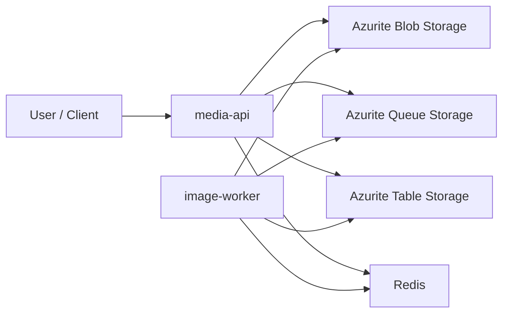
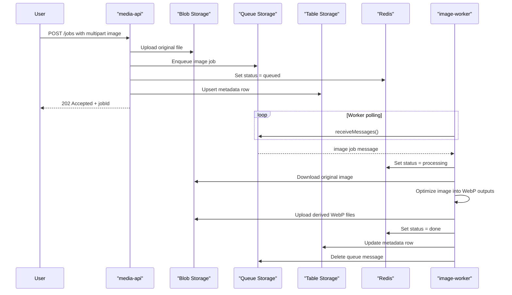
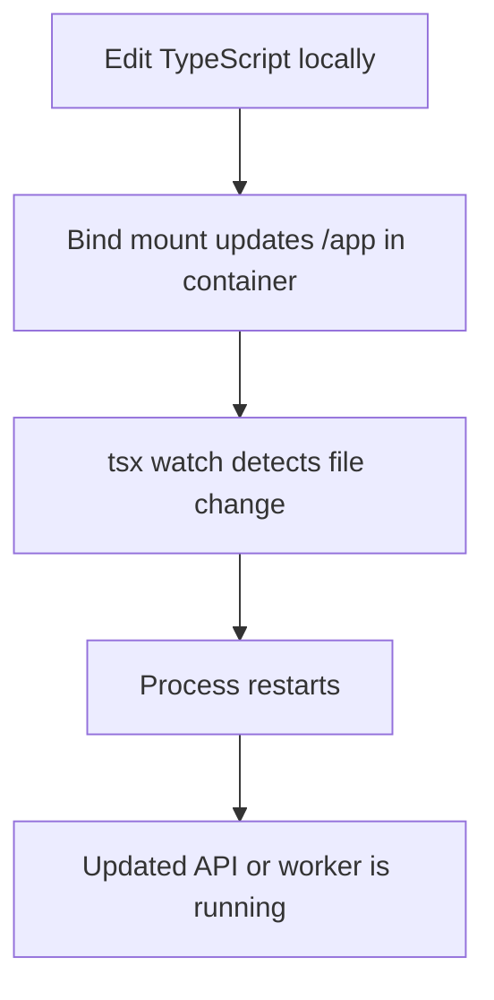

# Media Lab v1

Beginner-friendly Node.js project for learning:

- Docker and Docker Compose
- Azurite as a local Azure Storage emulator
- Azure Blob Storage
- Azure Queue Storage
- Azure Table Storage
- Redis
- async worker design

This v1 is intentionally optimized for local development, not production hardening.

## What This Project Does

The project accepts an uploaded image, stores the original in Blob Storage, sends an async message to Queue Storage, and lets a background worker create optimized WebP outputs.

It uses:

- Blob Storage for original and derived files
- Queue Storage for async job dispatch
- Table Storage for durable metadata
- Redis for fast-changing job status

## Why Option B

We chose the `Redis + Table Storage` design because each store has a clearer job:

- Redis is great for fast workflow state like `queued` or `processing`
- Table Storage is better for durable metadata you want to keep and inspect later

That means the project teaches both:

- ephemeral state
- durable metadata

## Architecture



## Sequence Diagram



## Project Structure

```text
media-lab/
├─ .dockerignore
├─ .env.example
├─ Dockerfile
├─ compose.yaml
├─ package.json
├─ tsconfig.json
├─ README.md
└─ src/
   ├─ server.ts
   ├─ types.ts
   ├─ lib/
   │  ├─ azure.ts
   │  ├─ config.ts
   │  ├─ media-jobs.ts
   │  ├─ naming.ts
   │  └─ redis.ts
   └─ workers/
      └─ image-worker.ts
```

## Naming Conventions

### Service Names

- `media-api`
- `image-worker`
- `azurite`
- `redis`

These names are descriptive enough to stay readable as the project grows.

### Blob Container

We use one container in v1:

- `media`

### Blob Paths

Original files:

- `originals/{jobId}/source.{ext}`

Derived files:

- `derived/{jobId}/image-1200.webp`
- `derived/{jobId}/image-thumb.webp`

Examples:

- `originals/01JSCYF9MVM6M4G4T1KJ2R9HZ0/source.heic`
- `derived/01JSCYF9MVM6M4G4T1KJ2R9HZ0/image-1200.webp`
- `derived/01JSCYF9MVM6M4G4T1KJ2R9HZ0/image-thumb.webp`

Why this convention is useful:

- original and derived files are clearly separated
- every job gets one predictable folder-like prefix
- user file names do not control storage identity
- cleanup and debugging are easier

### Queue Name

We use:

- `image-jobs`

Why:

- purpose is obvious
- this leaves room for future queues like `video-jobs`

### Table Storage Shape

The scaffold uses:

- `PartitionKey = media`
- `RowKey = jobId`

This makes it easy to group all media jobs while still giving each job a unique row key.

### Redis Keys

- `job:{jobId}:status`
- `job:{jobId}:derivedBlobs`

In v1, Redis is only for fast-changing state, not the long-term source of truth.

## Why Redis And Table Storage Both Exist

```text
Redis         -> "What is happening right now?"
Table Storage -> "What metadata should we still have tomorrow?"
```

Examples:

- Redis:
  - `job:abc123:status = processing`
- Table Storage:
  - original filename
  - blob names
  - timestamps
  - error message

## Docker Conventions

### Why One Shared Dockerfile

Both `media-api` and `image-worker` live in one Node.js project and share:

- the same Node version
- the same dependencies
- the same source tree

So they can share one Dockerfile and use different startup commands in `compose.yaml`.

### Why The Compose File Uses Bind Mounts

```yaml
volumes:
  - .:/app
  - /app/node_modules
```

`.:/app` is the development bind mount.

That means:

- your local project folder is mounted into `/app` in the running container
- when you edit a file on your machine, the container sees it right away
- `tsx watch` can restart the app or worker automatically

`/app/node_modules` is a Docker-managed volume.

That keeps container-installed dependencies from being hidden by the bind mount.

### Azurite Hostname In Docker

The scaffold uses explicit Azurite connection strings instead of `UseDevelopmentStorage=true`.

- On the host, `.env` points storage endpoints at `127.0.0.1`
- In Docker Compose, the service override points the same endpoints at `azurite`

This avoids the common mistake where a container tries to reach Azurite on its own loopback interface.

### Azurite API Version Checks

Recent Azure SDK releases can send a storage API version newer than the Azurite image bundled in local development.

The Compose setup runs Azurite with `--skipApiVersionCheck` so local containers can still talk to the emulator without pinning older SDK packages.

## Code Quality Tooling

This scaffold now includes:

- `ESLint` for linting
- `Prettier` for formatting

Useful commands:

```bash
npm run lint
npm run lint:fix
npm run format
npm run format:check
npm run typecheck
```

### Why This Setup Is Beginner-Friendly

- ESLint catches common mistakes and inconsistent patterns
- Prettier handles formatting automatically so you do not have to debate style
- the rules are intentionally light to avoid overwhelming v1

### PyCharm Tips

In PyCharm, a nice setup is:

- enable ESLint so editor warnings show inline
- enable Prettier integration for formatting
- optionally format on save

This gives you quick feedback without needing pre-commit hooks on day one.

## Development Flow



## API Surface In v1

### `GET /health`

Purpose:

- quick health check for local development

### `POST /jobs`

Purpose:

- upload one image
- create one async optimization job

Expected form field:

- `image`

### `GET /jobs/:jobId`

Purpose:

- inspect current job status
- inspect table metadata
- inspect derived blob names known by Redis

## Expected Formats In v1

Accepted input:

- `image/jpeg`
- `image/png`
- `image/webp`
- `image/heic`
- `image/heif`

Output:

- always WebP

This means the pipeline normalizes multiple image inputs into one optimized output format.

## Polling Behavior

The worker polls the queue continuously.

Current convention:

- when no message is found, sleep for `WORKER_POLL_INTERVAL_MS`
- default is `3000` milliseconds

Why not poll every minute:

- image processing would feel unresponsive
- queue-based job systems usually poll more frequently

## Edge Cases To Think About

### Upload edge cases

- user uploads no file
- user uses the wrong form field name
- uploaded file is not an image
- uploaded file is too large

### Storage edge cases

- Azurite is not running
- blob container does not exist yet
- queue does not exist yet
- table does not exist yet

The scaffold handles resource creation at startup/use time with `createIfNotExists` style calls.

### Processing edge cases

- source image is corrupt
- source image type is technically an image but not decodable by `sharp`
- HEIC support depends on the underlying image stack and should be tested early
- worker crashes after downloading but before upload completes
- worker finishes upload but crashes before deleting the queue message

### State consistency edge cases

- Redis says `done` but table metadata is stale
- table row exists but Redis key is missing
- queue message is retried and a partially completed job runs again

These are normal distributed-system learning cases and are useful to observe in v1.

## Negative Cases

Negative cases are intentionally "bad path" scenarios you should test.

### Negative case 1: Missing file

Input:

- `POST /jobs` without an `image` field

Expected:

- `400 Bad Request`

### Negative case 2: Non-image upload

Input:

- upload a text file as the `image` field

Expected:

- `400 Bad Request`

### Negative case 3: Azurite stopped

Input:

- run `media-api` while Azurite is unavailable

Expected:

- upload flow fails
- logs help explain why

### Negative case 4: Redis unavailable

Input:

- stop Redis and query/create jobs

Expected:

- status tracking fails
- job creation or polling may fail depending on code path

### Negative case 5: Worker processing failure

Input:

- queue a corrupt image

Expected:

- Redis status becomes `failed`
- Table Storage row stores an error message
- queue message is not deleted, so it can reappear after visibility timeout

## Local Setup

1. Copy `.env.example` to `.env`.
2. Run `docker compose up --build`.
3. Wait for `media-api` and `image-worker` logs.
4. Call `GET http://localhost:3000/health`.
5. Upload an image with `POST /jobs`.

Example upload command:

```bash
curl -X POST http://localhost:3000/jobs \
  -F "image=@/absolute/path/to/photo.heic"
```

Example status command:

```bash
curl http://localhost:3000/jobs/<jobId>
```

## Good Learning Steps After v1

Once this feels comfortable, good next steps are:

- add a second queue for video jobs
- add retry / poison-message handling
- add a UI
- emit domain events to Event Hubs
- use Blob Storage for Event Hubs checkpoints in a later event-streaming version

## Beginner Notes

This scaffold intentionally favors clarity over completeness.

You will notice that some production concerns are not fully handled yet:

- auth
- retries with max dequeue counts
- idempotency
- detailed validation
- observability beyond logs
- production-grade container hardening

That is okay.

The goal of v1 is to make the moving parts visible and understandable first.
